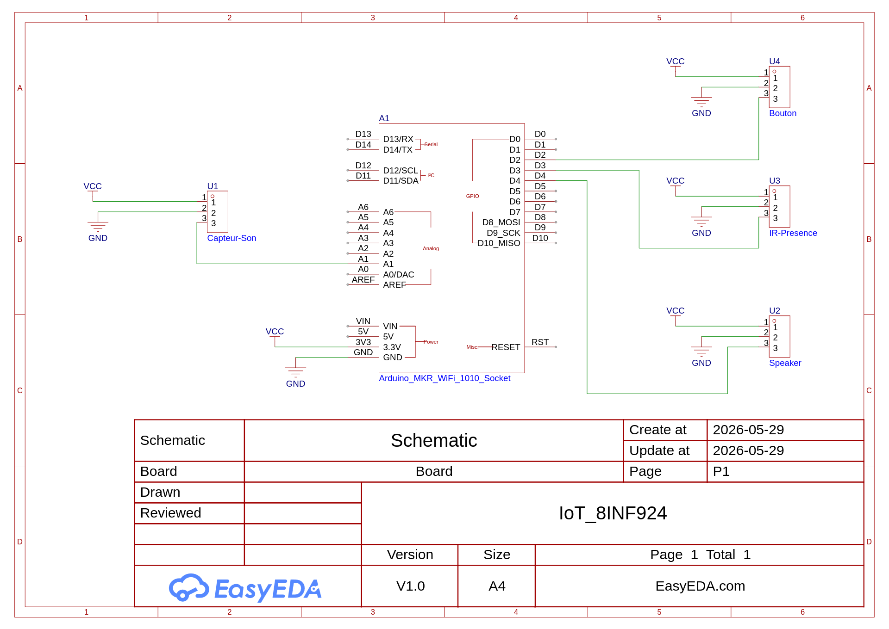
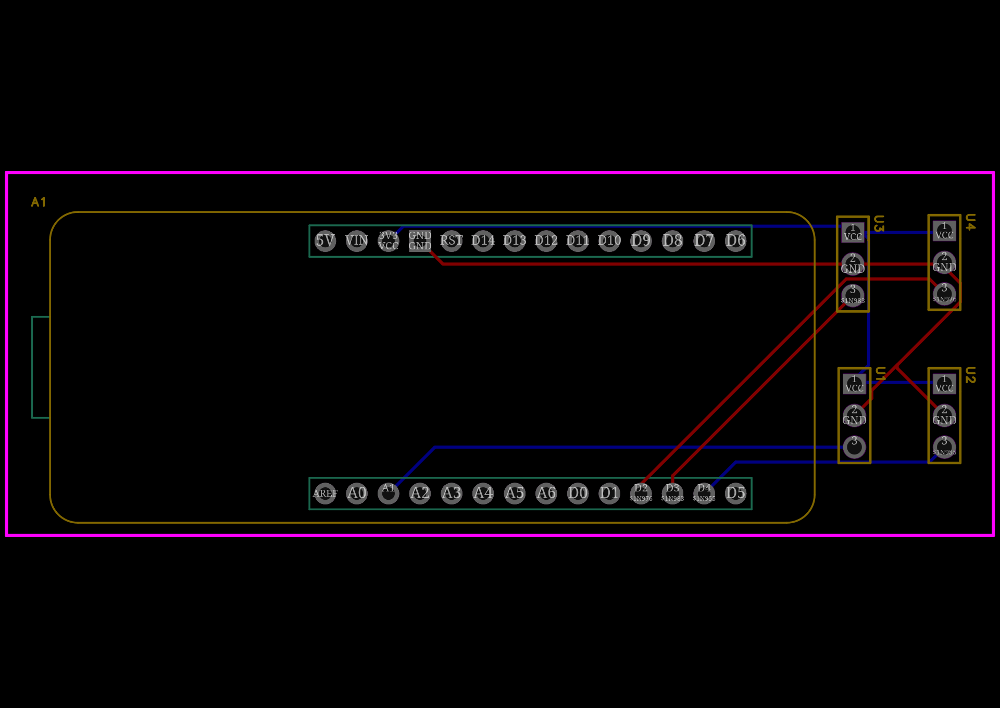

# 8INF924 — Internet des Objets (IoT) | UQAC
## Projet de Session : Sujet 2 — Sonnette (pas si) intelligente

Ce dépôt contient l'ensemble des livrables (code source, schémas, et documentation) pour la réalisation de notre prototype de sonnette connectée dans le cadre du cours **8INF924 — Internet des Objets** à l'Université du Québec à Chicoutimi (UQAC).

---

## 📌 Liens Utiles et Ressources

* **📂 Dossier Google Drive :** [Lien vers notre Google Drive](https://drive.google.com/drive/folders/1QAB8TGwj6tMms-aaFJpvWMOTLZgNMYCz?usp=sharing)*
* **📐 Projet EasyEDA :** [Lien vers notre projet EasyEDA](https://u.easyeda.com/join?type=project&key=fac310169bb212075f3a17a619c96056&inviter=c13f891e938d48d1b52ad1fcd24347ec)
* **🎓 Moodle du cours :** [Accès au cours 8INF924](https://moodle.uqac.ca/course/view.php?id=19530)
* **📧 Enseignant :** Florentin Thullier (fthullie@uqac.ca) — Bureau : P3-5040

---

## 👥 Membres de l'Équipe
* **Membre 1** (Martin) — *Rôle suggéré : Firmware & Intégration*
* **Membre 2** (Julian) — *Rôle suggéré : Hardware, Schématique & PCB*
* **Membre 3** (Nolan) — *Rôle suggéré : Backend, Base de données & Notifications*

---

## 🎯 Objectif du Projet

L'objectif est de concevoir et réaliser une sonnette connectée autonome capable de :
1.  **Détecter une présence** devant la porte.
2.  **Interagir avec le visiteur** via un haut-parleur.
3.  **Informer l'utilisateur à distance** en temps réel via un système de notifications.
4.  **Assurer une redondance physique** grâce à un bouton classique en backup.

---

## 🛠️ Matériel Requis & Architecture

Nous avons opté pour une approche simple et efficace en utilisant le matériel de prêt suivant :

### 1. Contrôleur Central
* **Arduino MKR1010**: Connectivité Wi-Fi native et simplicité de programmation.

### 2. Capteurs et Actionneurs
* **Détection de présence :** Capteur infrarouge de mouvement (IR sensor) **SEN0018**.
* **Interaction sonore (Entrée) :** Capteur de son (Sound sensor) **DFR0034**.
* **Interaction sonore (Sortie) :** Module haut-parleur numérique (Speaker) **FIT0449**.
* **Bouton de secours :** Bouton-poussoir physique (Push button) **DFR0029**.

---

## 🏗️ Structure du Dépôt GitHub

```text
├── .gitignore
├── README.md
├── /firmware               # Code source Arduino (.ino) à téléverser sur le MKR1010
│   ├── firmware.ino        # Fichier principal
│   └── config.h            # Configurations Wi-Fi, clés API et pins
├── /hardware               # Fichiers de conception électronique
│   ├── /bom                # Nomenclature des composants (Bill of Materials)
│   └── /gerber             # Fichiers Gerber pour la fabrication du PCB
└── /backend                # Code du serveur de gestion des données et notifications
    ├── server.py / js      # Script principal du backend
    └── database/           # Scripts de configuration de la base de données
```

---

## 📋 Tâches Minimales à Réaliser

### 🛰️ Étape 1 : Conception Matérielle (Hardware)
* [ ] Concevoir physiquement le module IoT de développement avec le matériel de prêt.
* [x] Concevoir le schematics et le PCB du prototype à l'aide d'un outil d'EDA comme vu en classe (EasyEDA, Altium, Eagle, etc.).

### 💻 Étape 2 : Développement du Firmware et Réseau
* [ ] Développer le firmware du module selon les fonctionnalités requises et/ou proposées.
* [ ] Communiquer les données (sans-fil) à une application backend.

### 🗄️ Étape 3 : Backend, Base de données & Notifications
* [ ] Mettre en place un backend pour la gestion des notifications et la journalisation des événements.*Note : Il est possible de le développer spécifiquement ou d'utiliser des composants logiciels existants.*
* [ ] S'assurer que les données soient persistées dans une base de données.

---

## 📐 Conception Matérielle

Pour la conception du prototype, nous avons utilisé le logiciel **EasyEDA** afin de réaliser à la fois le schéma logique (Schematics) et le circuit imprimé (PCB). Tous les composants sont alimentés en **3.3V** pour respecter la tension logique de l'Arduino MKR1010.

### 1. Schéma Électronique (Schematic)
Le câblage a été pensé pour être le plus simple et robuste possible. L'attribution des broches (Pinout) est la suivante :
* **Bouton Poussoir (DFR0029)** ➔ Broche Digitale **D2**
* **Capteur Infrarouge (SEN0018)** ➔ Broche Digitale **D3**
* **Haut-parleur (FIT0449)** ➔ Broche Digitale **D4** (PWM)
* **Capteur de Son (DFR0034)** ➔ Broche Analogique **A1**



### 2. Circuit Imprimé (PCB)
Le routage de la carte a été optimisé pour être le plus compact possible. Nous avons utilisé un routage double face (TopLayer en rouge, BottomLayer en bleu) pour éviter le croisement des pistes. 




